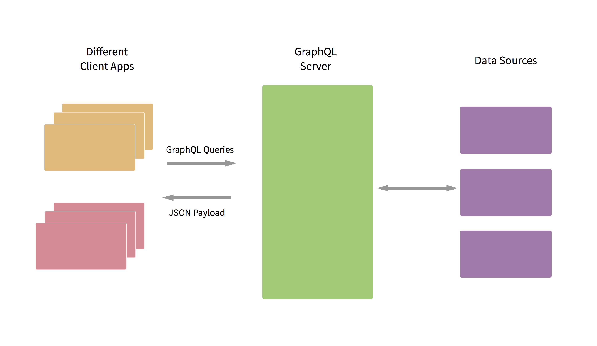

# GraphQL

## Overview
GraphQL is an **application layer query language** from Facebook. With it, you can define your backend as a **well-defined graph-based schema**. Then client applications can query your dataset as they are needed. This means you don't need to change your backend for data requirement changes in client apps.



## Querying

### Fields
At its simplest, GraphQL is about asking for specific fields on objects.

This:
```graphql
{
  hero {
    name
  }
}
```

Returns:
```graphql
{
  "data": {
    "hero": {
      "name": "R2-D2"
    }
  }
}
```

Fields can also refer to `Object`s. In that case, you can make a sub-selection of fields for that object. GraphQL queries can traverse related objects and their fields, letting clients fetch lots of related data in one request, instead of making several roundtrips as one would need in a classic REST architecture.

This:
```graphql
{
  hero {
    name
    # Queries can have comments!
    friends {
      name
    }
  }
}
```

Returns:
```graphql
{
  "data": {
    "hero": {
      "name": "R2-D2",
      "friends": [
        {
          "name": "Luke Skywalker"
        },
        {
          "name": "Han Solo"
        },
        {
          "name": "Leia Organa"
        }
      ]
    }
  }
}
```

## Reference
- [Learn GraphQL by Kadira](https://learngraphql.com/basics/introduction)
